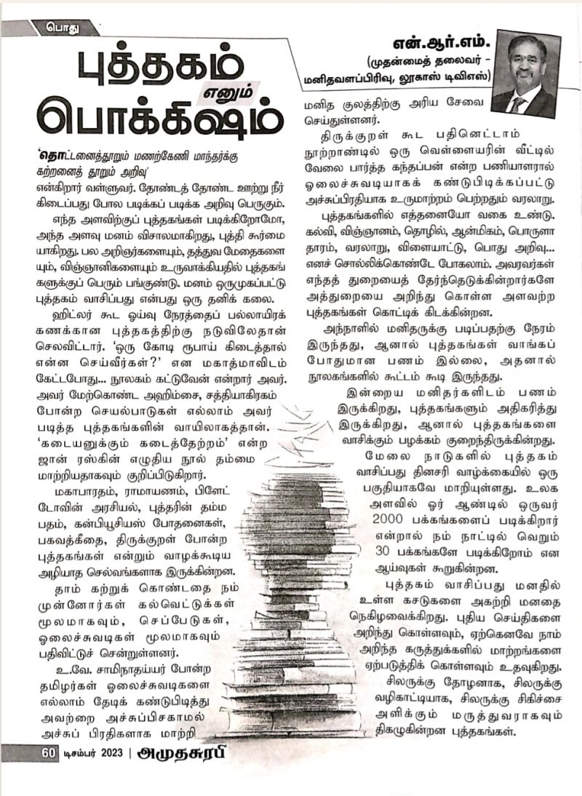
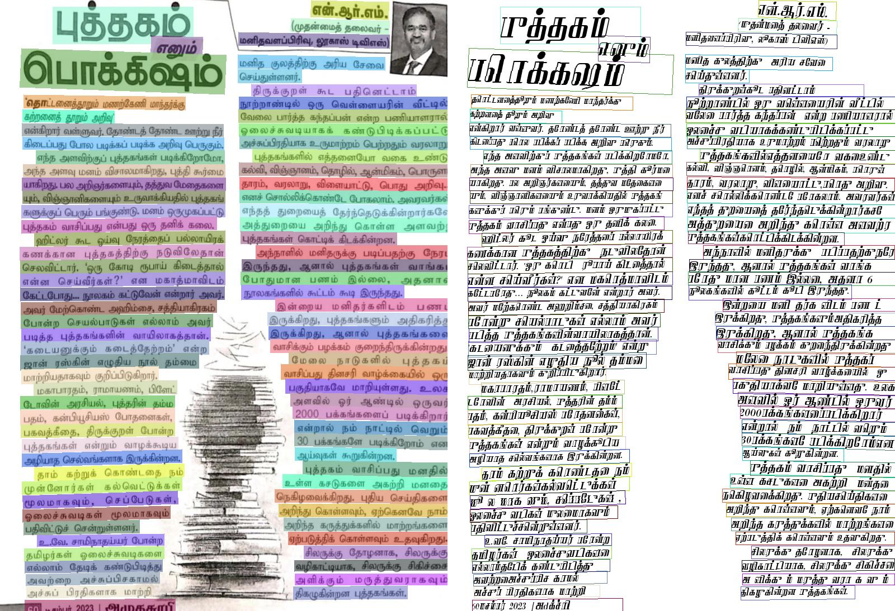

<p align="center">
  
</p>

<h1 align="center">🔤 Tamil Newspaper OCR Scanner</h1>

<p align="center">
  <strong>Extract Tamil text from scanned newspapers with high accuracy using PaddleOCR</strong>
</p>

<p align="center">
  <a href="https://www.python.org/downloads/"></a>
  <a href="https://github.com/PaddlePaddle/PaddleOCR"></a>
  <a href="LICENSE"></a>
  <a href="#"></a>
  <a href="#"></a>
</p>

<p align="center">
  <a href="#-demo">Demo</a> •
  <a href="#-features">Features</a> •
  <a href="#-quick-start">Quick Start</a> •
  <a href="#-usage">Usage</a> •
  <a href="#-output-formats">Output</a> •
  <a href="#-acknowledgements">Acknowledgements</a>
</p>

---

## 📰 Demo

### Input → Output Comparison

<table>
<tr>
<td width="50%">

**📥 Input: Scanned Newspaper**



</td>
<td width="50%">

**📤 Output: Detected Text Regions**



</td>
</tr>
</table>

### 📊 OCR Results

| Metric | Value |
|--------|-------|
| **Lines Extracted** | 84 |
| **Average Confidence** | 96.5% |
| **Processing Time** | ~8 seconds |
| **Text Types** | Tamil, English mixed |

### 📝 Sample Extracted Text

```tamil
புத்தகம் எனும் போக்கஷம்

'தொட்டனைத்தூறும் மணற்கேணி மாந்தர்க்கு
கற்றனைத் தூறும் அறிவு'
                — திருக்குறள்

என்கிறார் வள்ளுவர். தோண்டத் தோண்ட ஊற்று நீர்
கிடைப்பது பொல படிக்கப் படிக்க அறிவு பெருகும்.

எந்த அளவிற்குப் புத்தகங்கள் படிக்கிறோமோ,
அந்த அளவு மனம் விசாலமாகிறது, புத்தி கூர்மை யாகிறது.
```

---

## ✨ Features

<table>
<tr>
<td width="50%">

### 🎯 High Accuracy OCR
- **96.5% average confidence** on Tamil text
- Handles complex newspaper layouts
- Supports mixed Tamil-English content

</td>
<td width="50%">

### 🚀 Mac M1 Optimized
- CPU-based inference (no GPU required)
- Optimized for Apple Silicon
- Python 3.10+ compatible

</td>
</tr>
<tr>
<td width="50%">

### 📊 Multiple Output Formats
- **Plain text** (.txt)
- **JSON** with coordinates & confidence
- **Annotated images** with text boxes

</td>
<td width="50%">

### 🔧 Easy to Use
- Single command execution
- Automatic model download
- Minimal configuration needed

</td>
</tr>
</table>

---

## ⚡ Quick Start

### Prerequisites

- **Python 3.10+** (3.11 recommended)
- **macOS** with Apple M1/M2/M3 chip
- **4GB+ RAM** available

### Installation

#### Option 1: Automated Setup (Recommended)

```bash
git clone https://github.com/metalsrini/tamil-newspaper-ocr.git
cd tamil-newspaper-ocr
chmod +x setup.sh
./setup.sh
```

#### Option 2: Manual Installation

```bash
# Create virtual environment with Python 3.11
python3.11 -m venv venv
source venv/bin/activate

# Install PaddlePaddle (CPU version for Mac)
pip install paddlepaddle

# Install PaddleOCR with all features
pip install "paddleocr>=2.9.0"

# Install additional dependencies
pip install opencv-python Pillow
```

---

## 🎮 Usage

### Basic Usage

```bash
# Activate the virtual environment
source venv/bin/activate

# Scan a Tamil newspaper image
python tamil_ocr.py /path/to/newspaper.jpg
```

### Command Line Examples

```bash
# Scan with default sample image
python tamil_ocr.py

# Scan a specific image
python tamil_ocr.py /path/to/your/tamil_newspaper.jpg

# Scan multiple images (loop)
for img in *.jpg; do python tamil_ocr.py "$img"; done
```

### Python API Usage

```python
from paddleocr import PaddleOCR
import os

# Disable model check for faster startup
os.environ['DISABLE_MODEL_SOURCE_CHECK'] = 'True'

# Initialize OCR with Tamil language
ocr = PaddleOCR(
    lang='ta',                          # Tamil language
    use_textline_orientation=True,      # Detect text orientation
    device='cpu',                       # Use CPU (Mac M1)
)

# Run OCR
result = ocr.predict("newspaper.jpg")

# Process results
for res in result:
    res.print()                         # Print to console
    res.save_to_img("output")           # Save annotated image
    res.save_to_json("output")          # Save JSON results
```

---

## 📁 Output Formats

The OCR scanner generates three types of output:

### 1. Plain Text (`extracted_text.txt`)

```
Tamil OCR Results - newspaper.jpeg
============================================================

என்.ஆர்.எம்.
புத்தகம்
(முதன்மைத் தலைவர் -
எனும்
மனிதவளப்பிரிவு, லூகாஸ் டிவிஎஸ்)
...
```

### 2. JSON with Coordinates (`*_res.json`)

```json
{
    "input_path": "newspaper.jpeg",
    "rec_texts": [
        "புத்தகம்",
        "எனும்",
        "..."
    ],
    "rec_scores": [0.9998, 0.9989, ...],
    "rec_boxes": [[94, 12, 345, 78], ...]
}
```

### 3. Annotated Image (`*_ocr_res_img.jpeg`)

Visual output with green bounding boxes around detected text regions.

---

## 📂 Project Structure

```
tamil-newspaper-ocr/
├── 📄 README.md              # This file
├── 📄 LICENSE                # Apache 2.0 License
├── 📄 requirements.txt       # Python dependencies
├── 📄 setup.sh               # Automated setup script
├── 📄 .gitignore             # Git ignore rules
│
├── 🐍 tamil_ocr.py           # Main OCR script
│
├── 📁 docs/                  # Documentation
│   └── 📁 images/            # Demo images
│       ├── sample_input.jpeg
│       └── sample_output.jpeg
│
└── 📁 output/                # Generated output (gitignored)
    ├── extracted_text.txt
    ├── *_res.json
    └── *_ocr_res_img.jpeg
```

---

## 🛠️ Configuration

### Adjusting Detection Sensitivity

Edit `tamil_ocr.py` to fine-tune detection:

```python
ocr = PaddleOCR(
    lang='ta',
    text_det_thresh=0.3,        # Lower = more sensitive (0.1-0.5)
    text_det_box_thresh=0.5,    # Lower = more boxes (0.3-0.7)
)
```

### Supported Image Formats

| Format | Extension | Supported |
|--------|-----------|:---------:|
| JPEG | `.jpg`, `.jpeg` | ✅ |
| PNG | `.png` | ✅ |
| BMP | `.bmp` | ✅ |
| TIFF | `.tiff`, `.tif` | ✅ |
| WebP | `.webp` | ✅ |
| PDF | `.pdf` | ✅ |

---

## 🐛 Troubleshooting

<details>
<summary><b>❌ "No text detected"</b></summary>

Try lowering the detection thresholds:
```python
text_det_thresh=0.2       # Default: 0.3
text_det_box_thresh=0.3   # Default: 0.5
```
</details>

<details>
<summary><b>❌ Memory Error</b></summary>

Reduce batch size:
```python
text_recognition_batch_size=2   # Default: 6
```
</details>

<details>
<summary><b>❌ PaddlePaddle installation fails</b></summary>

Ensure you're using Python 3.10 or 3.11:
```bash
python3.11 -m venv venv
source venv/bin/activate
pip install paddlepaddle
```
</details>

<details>
<summary><b>❌ Slow first run</b></summary>

The first run downloads models (~150MB). Subsequent runs are faster.
Set environment variable to skip connectivity check:
```bash
export DISABLE_MODEL_SOURCE_CHECK=True
```
</details>

---

## 🌍 Supported Languages

This project uses **PP-OCRv5** which supports 100+ languages. To use a different language:

```python
# Chinese
ocr = PaddleOCR(lang='ch')

# Hindi
ocr = PaddleOCR(lang='hi')

# Japanese
ocr = PaddleOCR(lang='japan')

# Korean
ocr = PaddleOCR(lang='korean')

# See full list at PaddleOCR documentation
```

---

## 🙏 Acknowledgements

- **[PaddleOCR](https://github.com/PaddlePaddle/PaddleOCR)** - The powerful OCR engine powering this project
- **[PaddlePaddle](https://www.paddlepaddle.org.cn/)** - The deep learning framework
- **Tamil OCR Model** - `ta_PP-OCRv5_mobile_rec` for Tamil text recognition

---

## 📄 License

This project is licensed under the **Apache License 2.0** - see the [LICENSE](LICENSE) file for details.

---

## 🌟 Star History

If you find this project useful, please consider giving it a ⭐!

---

<p align="center">
  Made with ❤️ for the Tamil community
</p>
